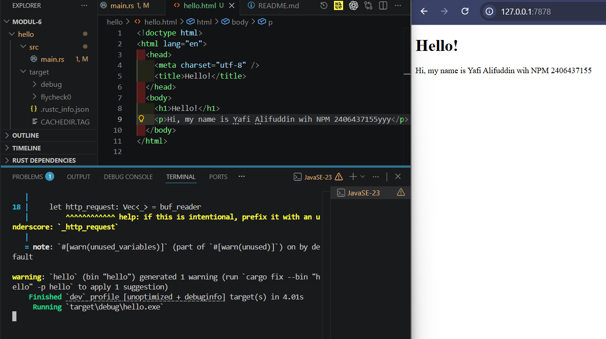
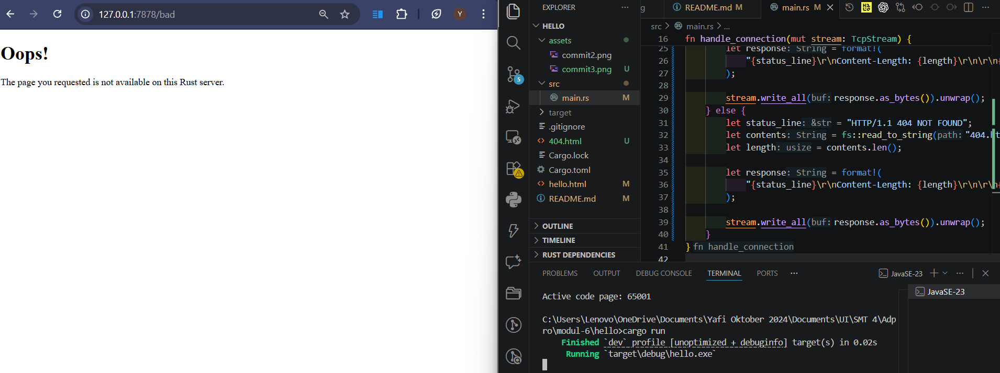

# Commit 1 Reflection Notes

Pada milestone ini saya mempelajari bagaimana web server sederhana bekerja pada level yang lebih rendah tanpa bantuan framework seperti Django. Program Rust ini menggunakan `TcpListener` untuk membuka port `127.0.0.1:7878` dan menunggu koneksi dari browser. Setiap koneksi yang masuk direpresentasikan sebagai `TcpStream`.

Pada versi awal, server hanya mencetak pesan `"Connection established!"` setiap kali browser terhubung. Dari sini saya memahami bahwa browser memang berhasil membuat koneksi ke server, tetapi karena server belum mengirimkan HTTP response apa pun, halaman di browser tidak menampilkan isi.

Pada versi berikutnya, koneksi ditangani oleh fungsi `handle_connection`. Fungsi ini menerima `TcpStream`, lalu membungkusnya dengan `BufReader` agar isi request dapat dibaca per baris. Ini penting karena HTTP request dikirim dalam format teks yang terdiri dari beberapa baris header.

Bagian yang paling penting untuk saya pahami adalah potongan berikut:

```rust
let http_request: Vec<_> = buf_reader
    .lines()
    .map(|result| result.unwrap())
    .take_while(|line| !line.is_empty())
    .collect();
```

Dari kode ini saya belajar beberapa hal:
- `.lines()` membaca stream menjadi baris-baris teks.
- `.map(|result| result.unwrap())` mengambil isi setiap baris dari `Result`.
- `.take_while(|line| !line.is_empty())` membaca hanya sampai baris kosong, karena pada protokol HTTP baris kosong menandakan akhir header.
- `.collect()` mengumpulkan semua baris tersebut ke dalam sebuah vector agar bisa dicetak atau diproses lebih lanjut.

Setelah menjalankan program dan membuka `http://127.0.0.1:7878`, saya bisa melihat isi request dari browser di terminal, misalnya `GET / HTTP/1.1`, `Host`, `User-Agent`, dan header lainnya. Dari sini saya jadi lebih paham bahwa browser dan server sebenarnya berkomunikasi menggunakan format request/response HTTP yang cukup terstruktur.

Hal lain yang saya pelajari adalah kenapa server perlu dihentikan terlebih dahulu sebelum dijalankan ulang. Jika proses sebelumnya masih berjalan, port `7878` masih dipakai sehingga program baru bisa gagal dijalankan.

Menurut saya, latihan ini membantu memahami fondasi web server yang biasanya disembunyikan oleh framework. Jika sebelumnya saya memakai framework tingkat tinggi, sekarang saya bisa melihat bahwa di baliknya ada proses mendengarkan koneksi, membaca request, lalu nanti mengirim response secara manual.


# Commit 2 Reflection Notes

Pada milestone ini saya mempelajari langkah berikutnya setelah server berhasil menerima request, yaitu mengirimkan HTTP response yang bisa dibaca dan dirender oleh browser. Jika pada milestone sebelumnya server hanya mencetak isi request ke terminal, sekarang server mulai benar-benar mengirimkan balasan ke client.

Perubahan utama ada di fungsi `handle_connection`. Setelah request dibaca, program membuat `status_line` dengan nilai `HTTP/1.1 200 OK`. Dari sini saya memahami bahwa response HTTP harus diawali dengan status line agar browser tahu hasil dari request yang dikirim. Kode ini juga membaca isi file `hello.html` menggunakan `fs::read_to_string`, sehingga konten HTML tidak ditulis langsung di dalam source code Rust.

Saya juga belajar bahwa `Content-Length` adalah bagian penting dari response header. Nilai ini memberi tahu browser berapa panjang isi response yang akan diterima. Setelah itu seluruh response digabung menggunakan `format!`, lalu dikirim ke browser melalui `stream.write_all(response.as_bytes())`. Dari proses ini saya jadi lebih memahami bahwa browser hanya bisa menampilkan halaman jika server mengirim response HTTP yang valid, bukan sekadar menerima koneksi.

Menurut saya, bagian ini menjelaskan hubungan yang lebih nyata antara server dan browser. Server membaca request dari client, lalu menyusun response secara manual yang terdiri dari status line, header, baris kosong, dan body berupa HTML. Ini membuat saya lebih paham struktur dasar protokol HTTP yang biasanya tidak terlihat saat menggunakan framework web tingkat tinggi.

Saya juga memahami kenapa file `hello.html` harus berada pada direktori yang sesuai saat program dijalankan. Karena program membaca file itu secara relatif, maka `cargo run` perlu dijalankan dari folder project yang memang berisi file `hello.html`. Jika tidak, program bisa gagal menemukan file tersebut.

Berikut adalah hasil tampilan halaman HTML yang berhasil dikirim oleh server:




# Commit 3 Reflection Notes

Pada milestone ini saya mempelajari bahwa web server seharusnya tidak selalu mengirim halaman yang sama untuk semua request. Server perlu memeriksa path yang diminta oleh browser agar bisa memberikan response yang sesuai. Pada implementasi ini, saya hanya mengambil baris pertama dari HTTP request, yaitu `request_line`, karena informasi tersebut sudah cukup untuk menentukan apakah browser meminta path `/` atau path lain.

Saya memahami bahwa penggunaan `buf_reader.lines().next().unwrap().unwrap()` lebih efisien dibanding membaca seluruh request seperti pada milestone sebelumnya. Untuk kebutuhan validasi sederhana, server cukup melihat request line seperti `GET / HTTP/1.1`. Jika nilainya cocok, server mengirim `hello.html` dengan status `HTTP/1.1 200 OK`. Jika tidak cocok, server mengirim `404.html` dengan status `HTTP/1.1 404 NOT FOUND`.

Bagian ini membuat saya lebih paham bahwa response HTTP terdiri dari beberapa bagian yang jelas: status line, header seperti `Content-Length`, baris kosong, dan body. Browser lalu menggunakan status code tersebut untuk memahami apakah request berhasil atau gagal, lalu merender isi HTML yang dikirim oleh server.

Saya juga mulai melihat kenapa refactoring dibutuhkan. Pada blok `if` dan `else`, alur kodenya hampir sama: membaca file, menghitung panjang isi, menyusun response, lalu menulis response ke stream. Yang berbeda hanya `status_line` dan nama file HTML. Karena ada duplikasi, kode menjadi lebih panjang dan lebih sulit dirawat. Refactoring dibutuhkan agar pemilihan `status_line` dan file bisa dipisahkan dari proses pembuatan response, sehingga kode menjadi lebih ringkas, lebih mudah dibaca, dan lebih mudah dikembangkan untuk response lain di masa depan.

Dari milestone ini saya belajar bahwa validasi request adalah langkah penting dalam pembuatan web server. Walaupun implementasinya masih sederhana, konsep ini sama dengan yang dilakukan framework web modern: setiap path atau route seharusnya diproses secara berbeda sesuai kebutuhan aplikasi.

Berikut adalah hasil tampilan halaman 404 dari server:




# Commit 4 Reflection Notes

Pada milestone ini saya mempelajari kelemahan utama dari web server yang masih berjalan dengan satu thread. Saya menambahkan endpoint `/sleep` yang secara sengaja menunda response selama 10 detik menggunakan `thread::sleep(Duration::from_secs(10))`. Tujuan simulasi ini adalah untuk menunjukkan bagaimana satu request yang lambat dapat memengaruhi request lain ketika server hanya memproses koneksi secara berurutan.

Setelah menjalankan server dan membuka dua browser atau dua tab, saya mencoba mengakses `http://127.0.0.1:7878/sleep` pada satu tab dan `http://127.0.0.1:7878` pada tab lain. Hasilnya, request ke halaman utama juga ikut tertahan sampai request `/sleep` selesai diproses. Dari percobaan ini saya memahami bahwa server single-threaded hanya dapat menangani satu request pada satu waktu. Selama thread utama sedang tidur atau sibuk memproses satu koneksi, request lain harus menunggu antrean.

Saya juga belajar bahwa pada implementasi ini, `match` digunakan untuk memilih response berdasarkan `request_line`. Pendekatan ini lebih rapi dibanding `if/else` sebelumnya karena semua kemungkinan route sederhana bisa dibaca dalam satu blok. Untuk `/`, server mengembalikan `hello.html`. Untuk `/sleep`, server menunggu 10 detik lalu tetap mengembalikan `hello.html`. Untuk path lain, server mengembalikan `404.html`.

Milestone ini penting karena memperlihatkan masalah performa yang nyata. Jika hanya satu pengguna membuka `/sleep`, pengguna lain yang sebenarnya meminta halaman biasa tetap terkena dampaknya. Dalam aplikasi sungguhan, kondisi seperti ini akan membuat server terasa lambat dan tidak responsif ketika ada banyak pengguna atau ada satu request yang memakan waktu lama.

Dari sini saya memahami alasan kenapa web server modern memerlukan concurrency, baik dengan multithreading, asynchronous programming, atau thread pool. Tanpa mekanisme tersebut, satu request lambat bisa memblokir seluruh server. Jadi milestone ini bukan hanya tentang menambahkan endpoint baru, tetapi tentang memahami bottleneck dari desain single-threaded sebelum masuk ke solusi yang lebih baik pada tahap berikutnya.
